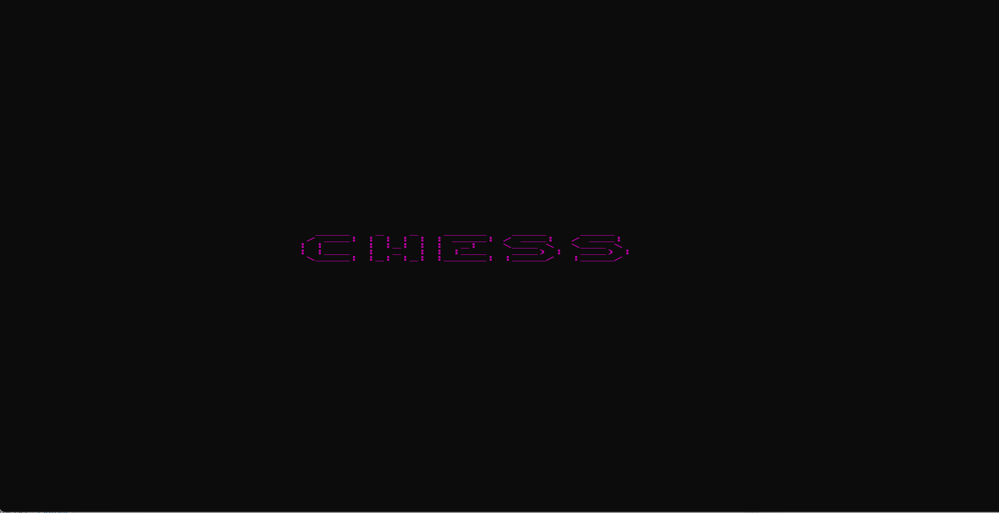
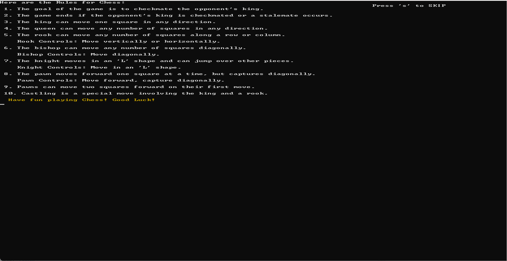
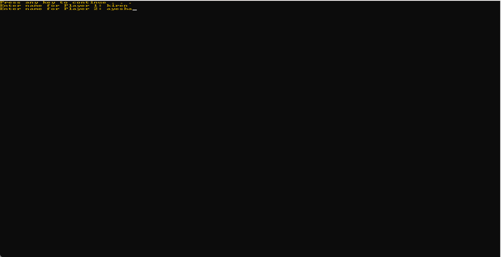
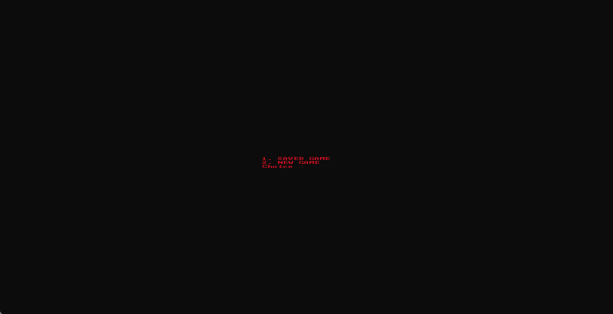
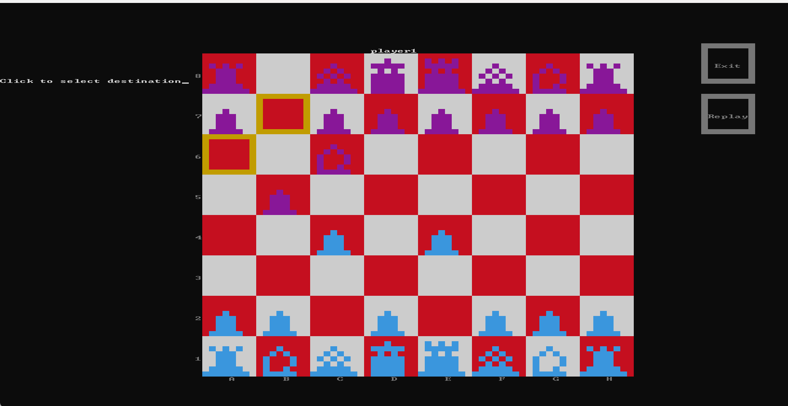

# ♟️ Console Chess

<p align="center">
  <b>A Feature-Rich Two-Player Chess Game built with C++</b>
  <br><br>
  Play a complete game of chess with legal move validation, save & load support, replay functionality, undo/redo, and all standard chess rules.
</p>

---

# 📖 Overview

**Console Chess** is a complete implementation of the classic Chess game developed using **C++**.

The project recreates the traditional chess experience inside the Windows console while supporting advanced gameplay features such as legal move validation, highlighted possible moves, castling, pawn promotion, check/checkmate detection, undo/redo, replay mode, and save/load functionality.

The project was developed to strengthen knowledge of data structures, object-oriented programming, algorithms, and game development using C++.

---

# 🎮 Gameplay

The objective is simple:

> **Capture your opponent's king by achieving checkmate while following all official chess rules.**

Players alternate turns selecting and moving pieces. The game validates every move, prevents illegal actions, detects check/checkmate, and supports replaying previously played games.

---

# ✨ Features

- ♟️ Complete two-player chess gameplay
- ✅ Legal move validation
- 🎯 Highlighted valid moves
- 👑 Check & Checkmate detection
- 🤝 Stalemate detection
- 🏰 King-side & Queen-side castling
- ♙ Pawn promotion
- 💾 Save game functionality
- 📂 Load previously saved games
- 🔄 Replay completed games
- ↩️ Undo & Redo system (3-second timer)
- 🖱️ Mouse-based piece selection
- 🎨 Interactive console interface

---

# 🛠 Tech Stack

| Technology | Purpose |
|------------|---------|
| C++ | Programming Language |
| Windows Console API | Graphics & Mouse Events |
| File Handling | Save, Load & Replay |
| Git | Version Control |
| GitHub | Repository Hosting |

---

# 🎮 How to Play

1. Launch the game.
2. Read or skip the instructions.
3. Enter both player names.
4. Choose:
   - New Game
   - Load Saved Game
5. Select pieces using the mouse.
6. Move according to standard chess rules.
7. Use Undo if needed within 3 seconds.
8. Replay completed games anytime.

---

# 📸 Screenshots

## ♟️ Game Start



---

## 📖 Instructions



---

## 👥 Player Names



---

## 💾 New Game / Saved Game



---

## 🎮 Gameplay



---

# 🏗 Game Flow

```text
Launch Game
      │
      ▼
 Welcome Screen
      │
      ▼
 Instructions
      │
      ▼
 Enter Player Names
      │
      ▼
 New Game / Load Saved Game
      │
      ▼
 Chess Board
      │
      ▼
 Select Piece
      │
      ▼
 Highlight Legal Moves
      │
      ▼
 Make Move
      │
      ▼
 Undo / Redo (3 Seconds)
      │
      ▼
 Check / Checkmate?
      │
      ├── Continue Game
      └── Game Over
      │
      ▼
 Save or Replay Game
```

---

# 📂 Project Structure

```text
Console-Chess
│
├── Chess.cpp
├── Screenshots
│   ├── Scene1.png
│   ├── Scene2.png
│   ├── Scene3.png
│   ├── Scene4.png
│   └── Scene5.png
├── README.md
└── ...
```

---

# 🚀 Key Concepts Implemented

- Complete chess engine
- Legal move validation
- Check detection
- Checkmate detection
- Stalemate detection
- Castling
- Pawn promotion
- Undo & Redo system
- Save & Load functionality
- Replay system
- Mouse event handling
- File handling
- Console graphics
- Dynamic board updates

---

# 📚 Learning Outcomes

This project helped me strengthen my understanding of:

- C++ programming
- File handling
- Dynamic memory management
- Algorithms
- Game logic
- Event handling
- Console graphics
- Debugging
- Git & GitHub

---

# 👨‍💻 Author

**Kiren Saleem**

This project was developed as an advanced C++ programming project to implement the complete rules of Chess while exploring game algorithms, object-oriented design, file handling, and interactive console-based game development.

---

## ⭐ Support

If you enjoyed this project or found it useful, consider giving the repository a **⭐ Star**.
